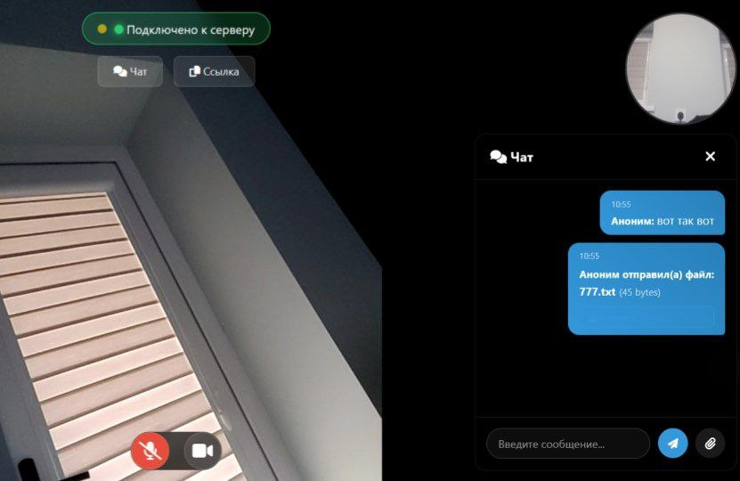

# P2P Video | Fastcall 

Простая и эффективная система для организации P2P-звонков в реальном времени. Проект использует **PeerJS** для установления прямого соединения между браузерами и **PM2** для управления серверной частью.

## 🚀 Инструкция по развертыванию

### 1. Серверная часть (PeerJS Server)
Для работы P2P соединений необходим сигнальный сервер. Скрипт `p2serv.bash` автоматизирует его запуск через PM2.

**Запуск:**
```bash
chmod +x p2serv.bash
./p2serv.bash yourdomain.com
```
### 2. Клиентская часть

Просто разместите файлы репозитория на любом веб-сервере (Nginx, Apache, или GitHub Pages).
* Важно: Для доступа к камере и микрофону браузеры требуют наличие HTTPS.

## 🛠 Требования
* Node.js
* PM2 (npm install pm2 -g)
* PeerJS (npm install peerjs -g)

## 🌟 Функции
* Видео\аудио чат
* Мессенджер
* Демонстрация экрана
* Обменник файлов


